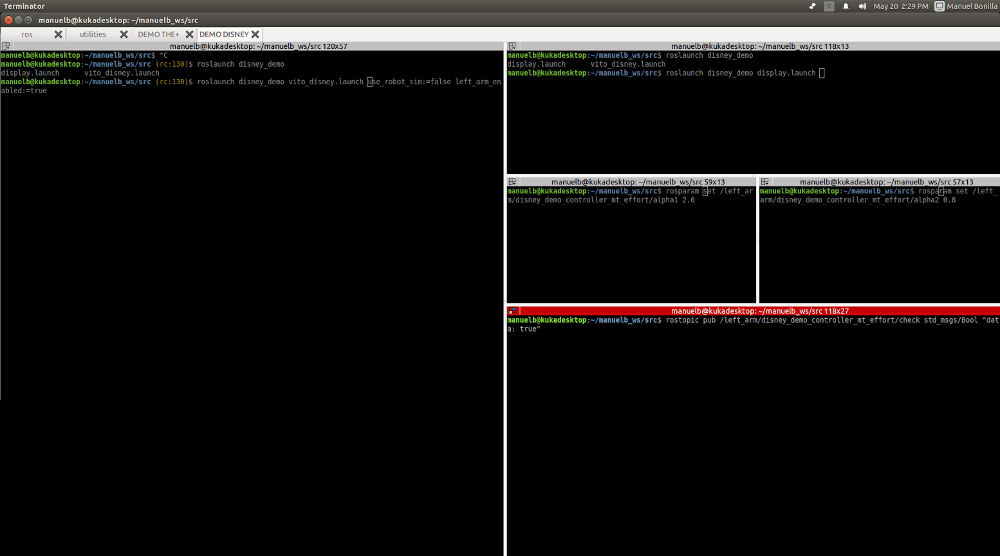

# DISNEY DEMO, fist bump
This demo replace the fist bumo movement of Disney's cartoon [Big Hero 6](https://www.youtube.com/watch?v=zVLA8fvBczg). The system uses a kuka LWR arm exploiting the [Vito ROS package](https://github.com/CentroEPiaggio/vito-robot/blob/master/README.md)  and a SoftHand with 2 motors. The user has to touch the hand in three different configuration for the complete fist bumb movement.

# Use
The command to launch the robot in simulation is:

`roslaunch disney_demo vito_disney.launch`
(select the simulation controller in the file /config/controllers_select.yaml  `disney_demo_controller_mt`)

The command to lauche the robot for real is:    
 
`roslaunch disney_demo vito_disney.launch use_robot_sim:=false left_arm_enabled:=true`
(select the real environment controller in the file /config/controllers_select.yaml  `disney_demo_controller_mt_effort`)

By default, the simulation and the real application is paused at the begining to wait for all controllers and stuff load. Starting the ros controller with the command:

`roslaunch disney_demo display.launch` 

After the controllers are running, in order to modify the robot velocity, it is possible to set the controllers ganins using the command:

`rosparam set /left_arm/disney_demo_controller_mt_effort/alpha1 2.0` 
`rosparam set /left_arm/disney_demo_controller_mt_effort/alpha2 0.8` 

